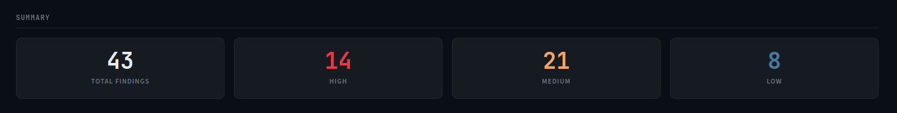
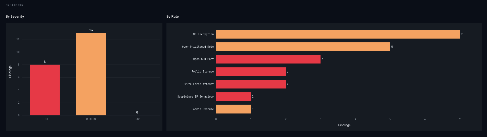
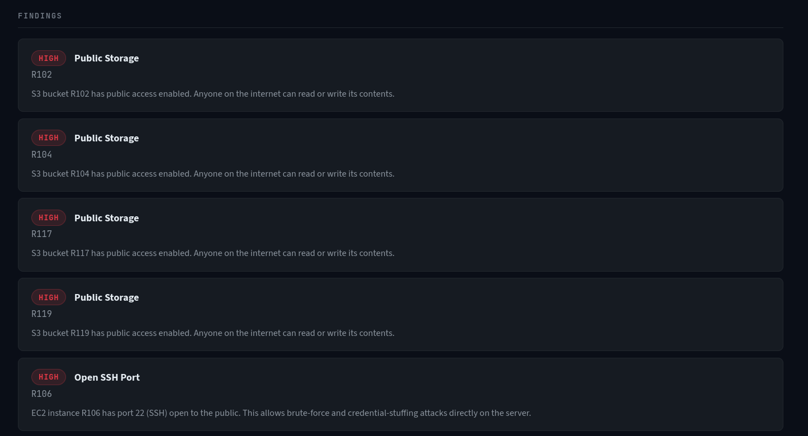

# Cloud Security Audit — Simulated AWS Environment


## Executive Summary

This report presents the findings of an automated security audit conducted against a simulated AWS environment consisting of S3 buckets, EC2 instances, and IAM roles. Activity logs spanning a single day were analyzed alongside static resource configurations. The audit detected **43 findings across 8 rule categories** — 14 HIGH, 21 MEDIUM, and 8 LOW severity. The environment exhibits a pattern of over-provisioned IAM roles, publicly exposed storage and compute resources, widespread encryption gaps, and active credential-based attack attempts. Taken together, these findings represent a credible and multi-path exploitable attack surface.

---

## Environment Overview

| Resource Type | Count |
|---------------|-------|
| S3 Buckets | 9 |
| EC2 Instances | 10 |
| IAM Roles | 7 |
| CloudTrail Log Events | 47 |
| Unique Users | 10 |

The audit ingested raw CloudTrail JSON and AWS Describe API output, normalized it through a parser layer, and ran it through a deterministic rule engine. No machine learning was used — all findings are based on explicit, auditable conditions.

---

## Summary Dashboard



---

## Key Findings

### 🔴 HIGH — Public S3 Buckets (Rule 1)

Three S3 buckets have public access enabled with no server-side encryption configured:

- `R102` (`dev-public-uploads`) — set to `public-read`; any unauthenticated user can enumerate and download its contents
- `R104` (`staging-data-dump`) — set to `public-read-write`; additionally allows unauthenticated writes, enabling data injection, content replacement, and storage of malicious payloads at the bucket owner's cost
- `R117` (`finance-reports-export`) — set to `public-read` with no encryption, no versioning, and no logging; this bucket is named for financial data, making it the highest-risk exposure in this category

None of these buckets have logging enabled, meaning unauthorized access would leave no trace in this environment.

**Risk:** Data exfiltration, unauthorized writes, compliance violation (PII and financial data exposure).

---

### 🔴 HIGH — EC2 Instances with Port 22 Open to the Internet (Rule 2)

Five EC2 instances — `R106`, `R108`, `R110`, `R121`, and `R123` — have port 22 (SSH) open to `0.0.0.0/0` and are reachable via a public IP address. Any host on the internet can initiate an SSH connection attempt against these instances.

This finding is made significantly more severe by overlapping misconfigurations:

- `R106`, `R110`, and `R123` are also assigned admin-level IAM instance profiles (Rule 3). A successful SSH compromise on any of these grants full AWS API access through the attached role — no credential theft required.
- `R106`, `R108`, `R121`, and `R123` also have encryption disabled (Rule 4).
- `R108` has no IAM instance profile at all, suggesting it was provisioned without a security baseline.

**Risk:** Remote code execution, privilege escalation, lateral movement to AWS control plane.

---

### 🔴 HIGH — Brute Force Login Attempts (Rule 5)

Three users — `charlie`, `frank`, and `heidi` — each triggered the brute force detection rule with 5+ consecutive failed `ConsoleLogin` events within a 1-minute window. All attempts originated from static IPs, consistent with automated credential stuffing tools.

`charlie` achieved a successful login later in the same day from the same IP (`198.51.100.7`). Whether this represents a legitimate user recovering access or a successful attack is ambiguous without MFA confirmation — but the pattern warrants investigation.

`heidi`'s 5 failures with no subsequent success suggests either an ongoing attack that did not yet succeed, or a locked-out user who did not pursue recovery through the console.

**Risk:** Unauthorized account access; elevated risk for any account holding admin-level permissions.

---

### 🔴 HIGH — Suspicious Multi-IP Logins (Rule 6)

Two users triggered the multi-IP detection rule:

**`eve`** authenticated from 4 distinct IPs within 2 minutes: `185.220.101.1`, `45.33.32.156`, `91.108.4.100`, and `103.21.244.0`. The first three attempts failed; the fourth succeeded. The IPs span multiple geographic regions and include addresses associated with anonymization infrastructure. The targeted resource was `R112`, an admin-level IAM role. The successful login from `103.21.244.0` should be treated as a confirmed account compromise.

**`ivan`** authenticated from 3 distinct IPs within 12 minutes: `77.88.55.66`, `31.13.64.35`, and `109.169.23.50`. The first two attempts failed; the third succeeded. Unlike `eve`, `ivan`'s targeted resource was not admin-level — however, the IP rotation pattern is identical and the successful login warrants review.

**Risk:** Active credential compromise on at least one account; potential admin-level access gained by external actor (`eve`).

---

### 🟡 MEDIUM — Pervasive Admin Role Assignment (Rule 3)

Admin-level IAM roles are assigned to 8 of the 26 audited resources: `R103`, `R104`, `R106`, `R109`, `R110`, `R112`, `R113`, `R123`, `R124`, and `R126`. This represents over 30% of the audited resource pool running with full administrative permissions — a significant violation of the principle of least privilege.

Of particular concern:

- `R112` is the admin IAM role targeted by `eve`'s multi-IP attack. A successful compromise here grants unrestricted AWS account access.
- `R106`, `R110`, and `R123` combine an admin instance profile with a publicly exposed SSH port — a single exploit away from full account takeover.
- `R124` is labelled `ci-cd-deployer` and carries `AdministratorAccess`. CI/CD pipelines with admin credentials are a common supply chain attack vector.
- `R126` (`data-pipeline-role`) carries `AdministratorAccess` with no tags and no description — indicating it was provisioned without documentation or review.

**Risk:** Maximum blast radius on any single resource compromise.

---

### 🟡 MEDIUM — Admin Account High-Activity Sessions (Rule 7)

The `admin` user executed 13 API actions across two distinct high-activity windows:

**Morning session (09:00–09:08 UTC):** `AttachRolePolicy`, `CreateUser`, `DeleteBucketPolicy`, `PutBucketAcl`, `ModifyInstanceAttribute`, `CreateAccessKey`, `DetachRolePolicy`, `TerminateInstances`. Notably, `CreateAccessKey` was called for user `alice` — issuing new programmatic credentials for another user is a common persistence technique.

**Evening session (18:00–18:08 UTC):** `DetachRolePolicy` on `R126`, `RunInstances` (provisioned `R123`), `PutBucketPolicy` on `R117`, `CreateRole` (`temp-migration-role`), `AttachRolePolicy` granting `AdministratorAccess` to the newly created role. Creating a temporary role with admin access and no documented purpose is a significant indicator of either a misconfigured automation script or a threat actor establishing a persistence mechanism.

**Risk:** Potential persistence established via `CreateAccessKey` and `temp-migration-role`; policy changes may have expanded the attack surface.

---

### 🟡 MEDIUM — Encryption Disabled (Rule 4)

Twelve resources have encryption disabled, including `R102`, `R104`, `R117`, `R119` (S3) and `R106`, `R108`, `R109`, `R110`, `R121`, `R123` (EC2 EBS volumes), and `R118` (`customer-pii-backup`) — a bucket explicitly tagged `data-classification: sensitive` with no encryption configured. The encryption gap compounds the risk of other findings rather than existing in isolation.

**Risk:** Plaintext data exposure if storage volumes are accessed outside the application layer; regulatory risk for `R118`.

---

### 🔵 LOW — CloudWatch Monitoring Disabled (Rule 8)

Eight EC2 instances have CloudWatch detailed monitoring disabled: `R106`, `R108`, `R109`, `R110`, `R120`, `R121`, `R123`, and one additional instance. This means CPU, network, and disk metrics are not available at the 1-minute granularity needed for effective incident response. Notably, several of these instances are already flagged for other HIGH and MEDIUM findings — the monitoring gap means that if those resources were actively exploited, the activity would be harder to detect and correlate in real time.

**Risk:** Reduced incident detection capability; delayed response during active exploitation.

---

## Findings Breakdown Charts




---

## Attack Scenarios

The findings above do not exist in isolation. When read together, three realistic breach paths emerge from this environment.

### Scenario A — Credential Compromise → Admin Escalation

```
eve attempts login from 4 IPs (Rule 6)
    └──▶ succeeds on 4th attempt → gains access to R112 (admin role)
              └──▶ R112 has AdministratorAccess attached (Rule 3)
                        └──▶ full AWS account control
                                  └──▶ reads R102, R104, R117 (public + unencrypted S3, Rules 1 + 4)
                                  └──▶ exfiltrates R118 (customer PII backup, Rule 4)
```

A single successful login grants an attacker unrestricted access to all resources in the account including unencrypted customer PII. No additional exploitation steps required.

---

### Scenario B — SSH Brute Force → AWS Control Plane

```
R106, R110, R123 have port 22 open to 0.0.0.0/0 (Rule 2)
    └──▶ SSH brute force succeeds (consistent with charlie/frank/heidi pattern, Rule 5)
              └──▶ shell access on instance with admin IAM profile (Rule 3)
                        └──▶ IMDS provides temporary AWS credentials automatically
                                  └──▶ attacker calls AWS CLI: CreateUser, AttachPolicy, exfiltrate S3
                                  └──▶ no CloudWatch alerts due to monitoring disabled (Rule 8)
```

An attacker who gains SSH access to any of these three instances does not need to steal IAM credentials — the EC2 Instance Metadata Service provides them automatically. Monitoring being disabled means this activity generates no alarms.

---

### Scenario C — Supply Chain via CI/CD Role

```
R124 (ci-cd-deployer) has AdministratorAccess (Rule 3)
    └──▶ CI/CD pipeline credentials compromised (consistent with brute force pattern, Rule 5)
              └──▶ attacker injects malicious step into deployment pipeline
                        └──▶ pipeline executes with full admin permissions
                                  └──▶ CreateUser + AttachAdminPolicy (mirrors admin session behavior, Rule 7)
                                  └──▶ persistent backdoor established before detection
```

CI/CD pipelines with admin credentials represent a supply chain risk that is harder to detect than direct console access — pipeline runs appear as normal deployments in CloudTrail until the malicious step executes.

---

## Findings Table - Filtered to high severity



---

## Recommendations Summary

| # | Rule Triggered | Priority | Recommended Fix |
|---|---------------|----------|-----------------|
| 1 | Public Storage | Immediate | Enable S3 Block Public Access on R102, R104, R117, R119; remove public ACLs |
| 2 | Open SSH Port | Immediate | Restrict Security Groups on R106, R108, R110, R121, R123 to known IP ranges; evaluate Session Manager |
| 6 | Suspicious IP | Immediate | Treat eve's session as compromised; rotate credentials; audit all actions taken post-login |
| 7 | Admin Overuse | Urgent | Audit both admin sessions; investigate `temp-migration-role` and `CreateAccessKey` for alice |
| 5 | Brute Force | Urgent | Enable account lockout policy; enforce MFA on all IAM users |
| 3 | Over-Privileged Role | High | Scope IAM roles to minimum permissions; remove admin from R106, R109, R110, R123, R124, R126 |
| 4 | No Encryption | High | Enable EBS encryption on all EC2 instances; enable SSE on all S3 buckets, prioritize R118 |
| 8 | Monitoring Disabled | Medium | Enable CloudWatch detailed monitoring on all EC2 instances, prioritize those with other findings |

---

## Methodology & Tooling

This audit was performed using a custom Python-based static analysis tool built on top of normalized CloudTrail and AWS Describe API data. The tool applies a deterministic rule engine with no external dependencies on cloud-native security services (GuardDuty, Security Hub, Config). All findings are reproducible by re-running the analysis against the same input files.

Detection rules, thresholds, and source code are available in the project repository. The parser, detection engine, and reporting layer are fully decoupled — the detection logic is input-format agnostic and can be pointed at any normalized dataset matching the expected schema.

---

*Simulated environment. All resource IDs, IP addresses, usernames, and account numbers are fictional and generated for demonstration purposes.*